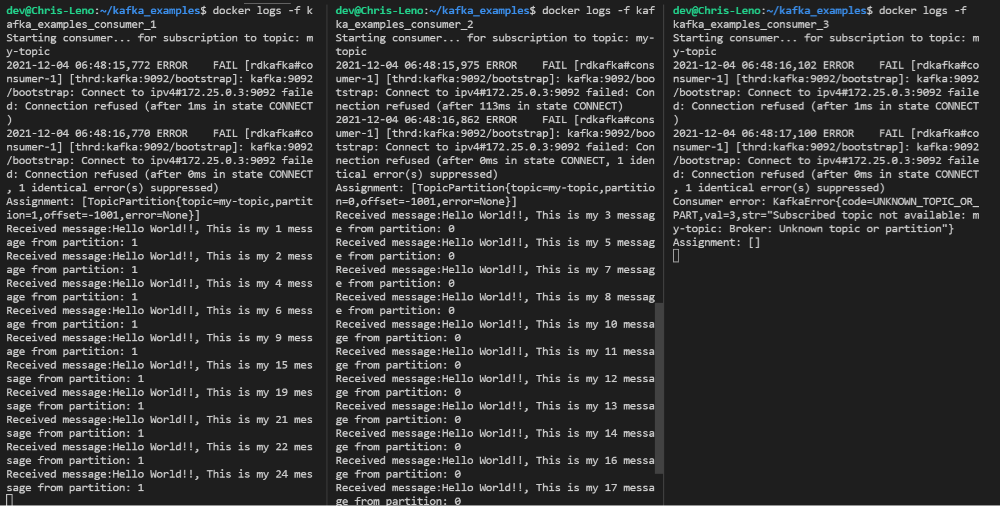
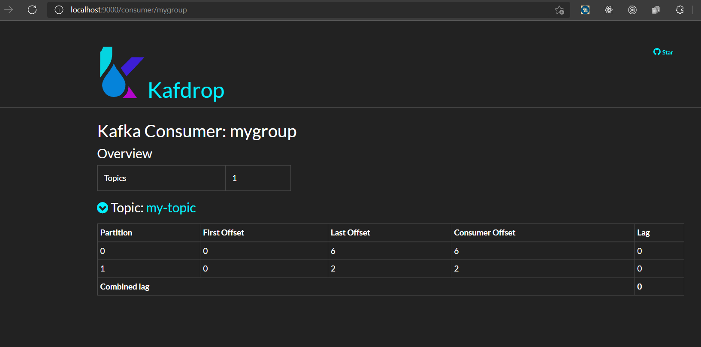

# An example to demostrate starvation of consumers
This is an example to demostrate that if the number of consumers are more than the number of kafka partitions then number of consumer which are above the number of partitions will starve for messages and will be idle since Kafka partition cannot be shared by more than one consumer

In a run of this example a topic: "my-topic" is created with 2 partitions and there consumers are spawned to consume messages. From the attached screenshot below it can found that docker instance kafka_examples_consumer_1 and kafka_examples_consumer_2 are able to consume message from partition 1 and 0 respectively but kafka_examples_consumer_3 is idling as there are no free partition to be connected

## Run command
```
docker-compose up -d --scale consumer=3
```

## Verify output command
```
docker logs -f kafka_examples_consumer_1
docker logs -f kafka_examples_consumer_2
docker logs -f kafka_examples_consumer_3
```



